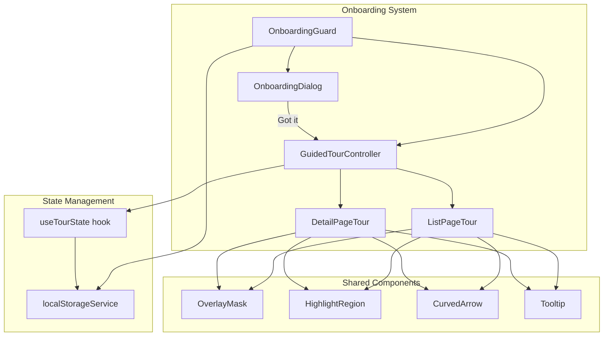
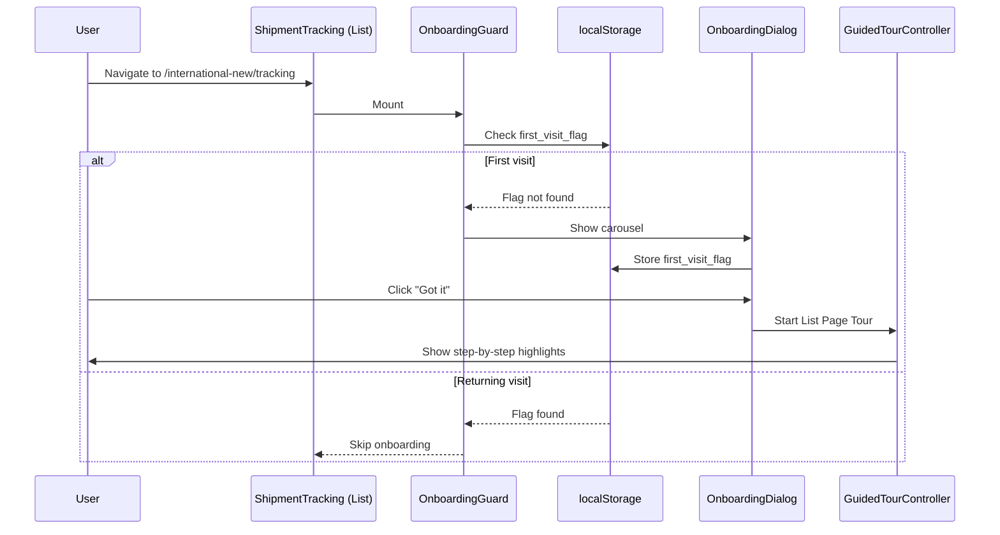

# Design Document: Shipment Tracking Onboarding Guide

## Overview

The Shipment Tracking Onboarding Guide is a two-phase user education system for the International module's Shipment Tracking pages. It combines a carousel-style onboarding dialog with a step-by-step guided tour to introduce new users to the List Page (`/international-new/tracking`) and Detail Page (`/international/tracking2/:id`) features.

**Phase 1 — Onboarding Dialog**: A modal carousel that presents feature thumbnails and descriptions for both the List Page and Detail Page, triggered on the user's first visit.

**Phase 2 — Guided Tour**: An interactive overlay system with highlight regions, curved arrows, and tooltips that walks users through on-page features in sequence.

The system uses `localStorage` for first-visit detection and tour completion persistence, ensuring the experience is shown only once per user/browser.

### Key Design Decisions

1. **Pure client-side state** — All persistence uses `localStorage`; no backend APIs needed.
2. **Component-based architecture** — Each UI element (overlay, tooltip, arrow, dialog) is a self-contained React component.
3. **Declarative tour configuration** — Tour steps and carousel slides are defined as data structures, making content updates trivial without code changes.
4. **Graceful degradation** — If `localStorage` is unavailable, the system silently skips all onboarding to avoid blocking page access.
5. **Shipment Journey Map** — The map component displays a route path example (origin → destination journey line) to visually demonstrate the tracking capability.

## Architecture



### Data Flow



## Components and Interfaces

### Core Components

#### `OnboardingGuard`
Top-level wrapper component that decides whether to show the onboarding dialog or guided tour.

```typescript
interface OnboardingGuardProps {
  page: 'list' | 'detail';
  children: React.ReactNode;
}
```

#### `OnboardingDialog`
Modal carousel dialog displaying feature introductions.

```typescript
interface OnboardingDialogProps {
  slides: CarouselSlide[];
  onComplete: () => void;  // "Got it" button clicked
  onDismiss: () => void;   // Backdrop/Escape dismiss
}
```

#### `GuidedTourController`
Manages tour step progression and renders overlay elements.

```typescript
interface GuidedTourControllerProps {
  steps: TourStep[];
  onComplete: () => void;
  onSkip: () => void;
}
```

#### `OverlayMask`
Full-viewport semi-transparent overlay with a cutout for the highlight region.

```typescript
interface OverlayMaskProps {
  highlightRect: DOMRect | null;
  borderRadius?: number;  // 4-8px
  opacity?: number;       // 0.4-0.6
}
```

#### `HighlightRegion`
Visual border/shadow around the highlighted element within the overlay cutout.

```typescript
interface HighlightRegionProps {
  targetRect: DOMRect;
  borderRadius?: number;
}
```

#### `CurvedArrow`
SVG bezier curve with arrowhead pointing from tooltip to highlight region.

```typescript
interface CurvedArrowProps {
  from: { x: number; y: number };
  to: { x: number; y: number };
  curvature?: number;
}
```

#### `TourTooltip`
Positioned text box with tour step description and navigation buttons.

```typescript
interface TourTooltipProps {
  content: string;
  position: 'top' | 'bottom' | 'left' | 'right';
  highlightRect: DOMRect;
  showNext?: boolean;
  showSkip?: boolean;
  onNext: () => void;
  onSkip: () => void;
}
```

### Hooks

#### `useLocalStorage`
Typed wrapper around localStorage with availability detection.

```typescript
function useLocalStorage<T>(key: string, defaultValue: T): {
  value: T;
  setValue: (val: T) => void;
  isAvailable: boolean;
}
```

#### `useTourState`
Manages current tour step, progression, and completion status.

```typescript
function useTourState(tourId: string, steps: TourStep[]): {
  currentStep: number;
  isActive: boolean;
  isCompleted: boolean;
  next: () => void;
  skip: () => void;
  start: () => void;
}
```

#### `useElementRect`
Tracks a DOM element's bounding rect, updating on scroll/resize.

```typescript
function useElementRect(selector: string): DOMRect | null;
```

### Service Layer

#### `localStorageService`
Centralized localStorage access with error handling.

```typescript
interface LocalStorageService {
  getFirstVisitFlag(): boolean;
  setFirstVisitFlag(): void;
  getListTourCompleted(): boolean;
  setListTourCompleted(): void;
  getDetailTourCompleted(): boolean;
  setDetailTourCompleted(): void;
  isAvailable(): boolean;
}
```

## Data Models

### CarouselSlide

```typescript
interface CarouselSlide {
  id: string;
  title: string;
  description: string;
  thumbnailSrc: string;      // Path to thumbnail image
  category: 'list' | 'detail';
  order: number;
}
```

### TourStep

```typescript
interface TourStep {
  id: string;
  targetSelector: string;    // CSS selector for the target element
  title: string;
  content: string;           // Tooltip text (max 2 sentences, ≤100 chars)
  position: 'top' | 'bottom' | 'left' | 'right';
  order: number;
}
```

### Tour Configuration Constants

```typescript
// List Page Carousel Slides (7 slides)
const LIST_PAGE_SLIDES: CarouselSlide[] = [
  { id: 'list-overview', title: 'Shipment Tracking List', description: '...', ... },
  { id: 'list-search', title: 'Quick Search', description: '...', ... },
  { id: 'list-recent', title: 'Recent Searches', description: '...', ... },
  { id: 'list-alerts', title: 'Risk Alert Cards', description: '...', ... },
  { id: 'list-tabs', title: 'Status Tabs', description: '...', ... },
  { id: 'list-table', title: 'Shipment Table', description: '...', ... },
];

// Detail Page Carousel Slides (5 slides)
const DETAIL_PAGE_SLIDES: CarouselSlide[] = [
  { id: 'detail-overview', title: 'Overview Tab', description: '...', ... },
  { id: 'detail-containers', title: 'Containers & Drayage', description: '...', ... },
  { id: 'detail-items', title: 'Items SKUs', description: '...', ... },
  { id: 'detail-customs', title: 'Customs Clearance', description: '...', ... },
  { id: 'detail-drayage', title: 'Drayage Load', description: '...', ... },
];

// List Page Tour Steps (5 steps)
const LIST_TOUR_STEPS: TourStep[] = [
  { id: 'step-search', targetSelector: '[data-tour="quick-search"]', ... },
  { id: 'step-recent', targetSelector: '[data-tour="recent-searches"]', ... },
  { id: 'step-alerts', targetSelector: '[data-tour="alert-cards"]', ... },
  { id: 'step-tabs', targetSelector: '[data-tour="status-tabs"]', ... },
  { id: 'step-table', targetSelector: '[data-tour="shipment-table"]', ... },
];

// Detail Page Overview Tour Steps (4 steps)
const DETAIL_OVERVIEW_STEPS: TourStep[] = [
  { id: 'step-info', targetSelector: '[data-tour="info-panel"]', ... },
  { id: 'step-progress', targetSelector: '[data-tour="progress-bar"]', ... },
  { id: 'step-timeline', targetSelector: '[data-tour="milestone-timeline"]', ... },
  { id: 'step-livemap', targetSelector: '[data-tour="shipment-journey-map"]', ... },
];

// Detail Page Tab Navigation Tour Steps (4 steps)
const DETAIL_TAB_STEPS: TourStep[] = [
  { id: 'step-tab-containers', targetSelector: '[data-tour="tab-containers"]', ... },
  { id: 'step-tab-items', targetSelector: '[data-tour="tab-items"]', ... },
  { id: 'step-tab-customs', targetSelector: '[data-tour="tab-customs"]', ... },
  { id: 'step-tab-drayage', targetSelector: '[data-tour="tab-drayage"]', ... },
];
```

### localStorage Keys

```typescript
const STORAGE_KEYS = {
  FIRST_VISIT_FLAG: 'shipment_tracking_onboarding_shown',
  LIST_TOUR_COMPLETED: 'shipment_tracking_list_tour_completed',
  DETAIL_TOUR_COMPLETED: 'shipment_tracking_detail_tour_completed',
} as const;
```


## Correctness Properties

*A property is a characteristic or behavior that should hold true across all valid executions of a system—essentially, a formal statement about what the system should do. Properties serve as the bridge between human-readable specifications and machine-verifiable correctness guarantees.*

### Property 1: Carousel navigation respects boundaries

*For any* carousel with N slides (N ≥ 1) and current position P (0 ≤ P < N):
- The slide indicator SHALL display `(P+1) / N`
- When P = 0, the left arrow SHALL be disabled
- When P = N-1, the right arrow SHALL be disabled
- When P < N-1, clicking the right arrow SHALL advance to position P+1

**Validates: Requirements 2.3, 2.5, 2.8**

### Property 2: Tour step progression

*For any* guided tour with T steps and current step index S (0 ≤ S < T-1), clicking the "Next" button SHALL advance the tour to step S+1, updating the highlight region, curved arrow, and tooltip to reflect the new target element.

**Validates: Requirements 6.6, 7.4, 8.1, 8.2, 8.3, 8.4**

### Property 3: Skip ends tour at any step

*For any* guided tour and any active step S (0 ≤ S < T), clicking the "Skip" button SHALL immediately remove the overlay mask and end the tour, regardless of which step is currently active.

**Validates: Requirements 6.8**

### Property 4: Tooltip content constraints

*For any* TourStep in any tour configuration (List Page, Detail Overview, or Tab Navigation), the tooltip content SHALL be no more than 100 characters in length and contain no more than 2 sentences.

**Validates: Requirements 9.1**

### Property 5: Tooltip positioning within viewport

*For any* highlight region rect and viewport dimensions, the computed tooltip position SHALL maintain a gap of 8–16px from the highlight region edge AND the tooltip SHALL remain fully within the viewport bounds. If the default position would cause viewport overflow, the tooltip SHALL be repositioned to the opposite side.

**Validates: Requirements 10.4, 10.6**

### Property 6: Highlight region encompasses target element

*For any* active TourStep with a resolvable target selector, the rendered HighlightRegion rect SHALL fully encompass the target element's bounding client rect, with border-radius between 4px and 8px.

**Validates: Requirements 6.3, 10.2**

### Property 7: Curved arrow connects tooltip to highlight

*For any* active TourStep, the CurvedArrow's start point SHALL be positioned at the tooltip edge and its end point (arrowhead) SHALL point toward the HighlightRegion boundary.

**Validates: Requirements 6.4, 10.3**

## Error Handling

| Scenario | Behavior |
|----------|----------|
| `localStorage` unavailable (private browsing, quota exceeded) | Skip all onboarding; allow normal page access. Detected via `localStorageService.isAvailable()` check on mount. |
| Target element not found for a TourStep | Skip that step and proceed to the next step in sequence. If no remaining steps, end the tour. |
| Carousel slides array is empty | Do not render the OnboardingDialog; proceed as if onboarding was already shown. |
| User navigates away mid-tour | End tour immediately without storing completion. Resume from step 1 on next visit. |
| Rapid "Next" button clicks | Debounce transitions; ignore clicks during active animation (200-400ms transition period). |
| Viewport resize during active tour | Recalculate highlight rect, tooltip position, and curved arrow on resize/scroll events using `useElementRect`. |
| Dialog backdrop click or Escape key | Close dialog without triggering the guided tour (dismiss only). |

## Testing Strategy

### Unit Tests (Example-Based)

Unit tests cover specific scenarios, content validation, and integration points:

- **First visit detection**: Verify dialog shows when flag absent, skips when present
- **localStorage unavailability**: Verify graceful degradation (no dialog, no tour)
- **Carousel content**: Verify all 11 slides exist with correct titles, descriptions, and order
- **Tour step content**: Verify all tooltip texts match requirements (9.3–9.11)
- **Dialog dismissal flows**: "Got it" triggers tour; backdrop/Escape dismiss without tour
- **Tour completion persistence**: Verify localStorage keys written on tour complete
- **Tour chaining**: Overview tour completion triggers tab navigation tour
- **Navigation away**: Tour resets on unmount/remount

### Property-Based Tests

Property-based tests validate universal behaviors using `fast-check`:

| Property | What's Generated | What's Verified |
|----------|-----------------|-----------------|
| Carousel navigation | Carousel of random length (1–20 slides), random current position | Boundaries respected, indicator correct |
| Tour step progression | Tour of random length (1–10 steps), random current step | Next advances correctly |
| Skip at any step | Tour of random length, random active step | Skip always ends tour |
| Tooltip content constraints | All configured tooltip strings | Length ≤ 100, sentences ≤ 2 |
| Tooltip positioning | Random highlight rects within random viewport sizes | Gap maintained, no overflow |
| Highlight region | Random target element rects | Region encompasses target |
| Curved arrow | Random tooltip/highlight positions | Arrow connects correct endpoints |

**Library**: `fast-check` (JavaScript/TypeScript property-based testing)
**Configuration**: Minimum 100 iterations per property test
**Tag format**: `Feature: shipment-tracking-onboarding-guide, Property {N}: {property_text}`

### Integration Tests

- Full onboarding flow: first visit → dialog → carousel navigation → "Got it" → tour start → step progression → completion
- Detail page tour trigger: list tour complete → navigate to detail → overview tour → tab tour
- Cross-session persistence: complete tour → refresh page → verify tour doesn't re-appear

### Edge Case Tests

- `localStorage` throws on read/write
- Target element removed from DOM between steps
- Rapid navigation (user clicks "Next" faster than animation completes)
- Very small viewport where tooltip can't fit on any side
- Component unmount during animation transition
